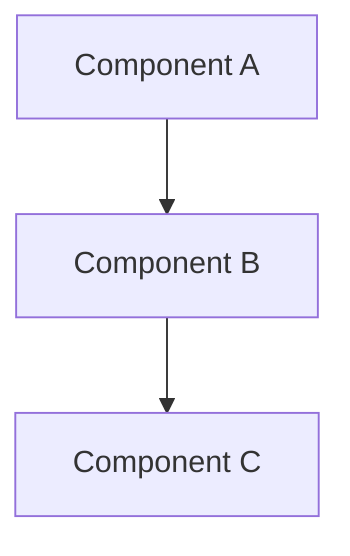

# TECHNICAL.md — Project Name

Senior-engineer technical reference.  
For plain-language overview, see [README.md](../README.md).

**Last reviewed:** YYYY-MM-DD

---

## System architecture

High-level description of components and how they interact.



## Repository layout

```text
src/
├── module_a/    # Responsibility
├── module_b/    # Responsibility
└── ...
```

## Component ownership

| Component | Module | Responsibility |
|-----------|--------|----------------|
| | | |

## Boot / initialization lifecycle

1. Entry point
2. Configuration load
3. Component initialization
4. Ready state

## Data flow

Describe how data moves through the system.

## State flow

Describe state machines or lifecycle states if applicable.

## Storage layout

Where files live, naming conventions, ownership.

## Configuration

Config file format, environment variables, defaults, migration.

## Logging

Log levels, destinations, rotation.

## Caching

What is cached, where, invalidation strategy.

## Concurrency

Threading model, async patterns, lock strategy.

## Memory management

Allocation patterns, pooling, limits.

## Networking

Protocols, endpoints, timeouts, retries.

## Performance

Known bottlenecks, optimization decisions, benchmark references.

## Security

Threat model summary. See SECURITY.md if it exists.

## Testing

Test types, how to run, coverage expectations.

## Deployment

Build, install, upgrade, rollback procedures.

## Failure handling

Error types, retry behavior, graceful degradation.

## Observability

Metrics, tracing, health checks.

## Benchmarking

Methodology and how to reproduce results.

## Design decisions

### ADR-001: Title

- **Status:** Accepted
- **Context:** Why this decision was needed
- **Decision:** What was chosen
- **Alternatives considered:** What else was evaluated
- **Consequences:** Tradeoffs and follow-up work

## Known limitations

Honest list of current constraints.

## Future improvements

Technical debt and planned architectural work.
