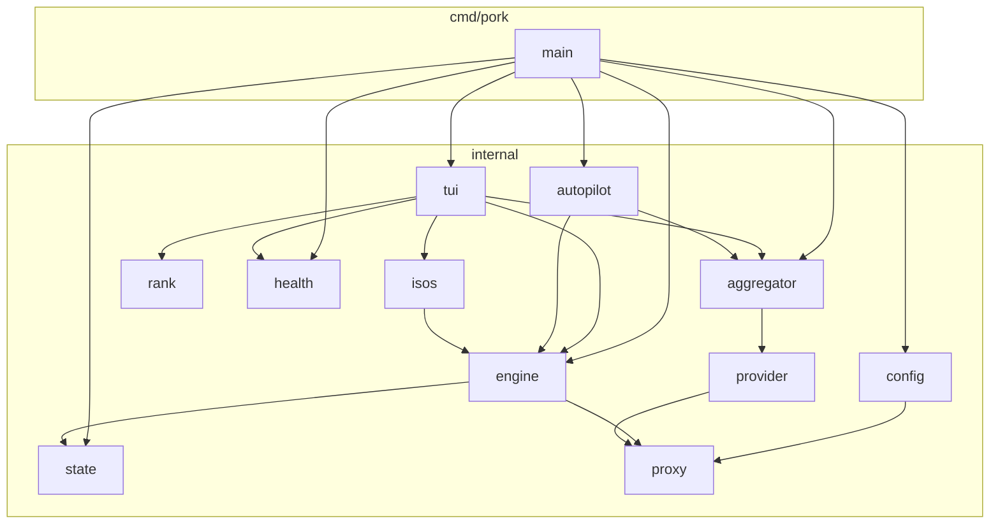
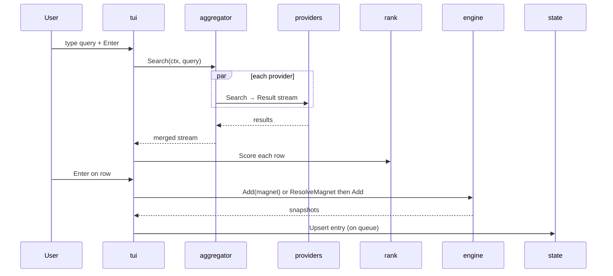
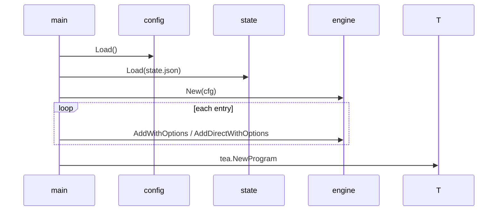
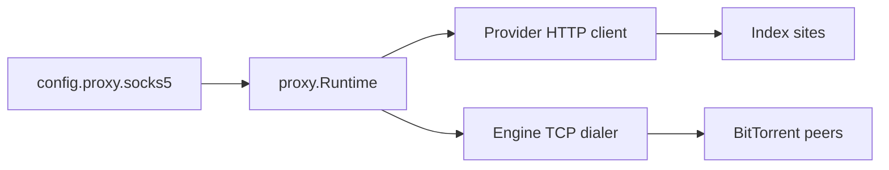

# TECHNICAL.md — Pork Engineering Reference

Senior-engineer reference for architecture, data flow, configuration, and design decisions.  
**Component map:** [ARCHITECTURE.md](ARCHITECTURE.md)  
**Beginner guide:** [README.md](README.md)

---

## 1. System architecture

Pork is a single-binary Go application. The default path starts a Bubble Tea TUI backed by an `anacrolix/torrent` client. Search is decoupled from download through a provider/aggregator layer so index fragility does not leak into the engine.



---

## 2. Package reference

### `cmd/pork`

CLI dispatcher. Responsibilities:

- Parse flags (`-d`, `--evil`) and subcommands (`autopilot`, `doctor`, `proxy`)
- Construct `config.Config`, `engine.Engine`, `aggregator.Aggregator`, `health.Store`
- Resume downloads from `state.json` via `resumeAll`
- Schedule background daily health check (`maybeCheckHealth`) with 45s warmup
- Wire enabled providers from config (built-in names + custom RSS/Torznab entries)

Version resolution: linker `-X main.version=…`, else `debug.ReadBuildInfo()`, else `dev`.

### `internal/tui`

Bubble Tea model with screens: `search`, `isos`, `results`, `preview`, `downloads`, `health`.

- `aggregator.Search` streams results; `rank` scores rows
- `engine` snapshots drive download progress bars
- `proxyBadge` shows SOCKS strict / Tor verified state after live egress check
- State saves throttled on tick and on quit

### `internal/aggregator`

Fans a query to all providers concurrently. Each provider runs with per-attempt timeout and up to 2 retries (jittered). Emits `StatusEvent` for UI status lines. `WithFilter` applies `provider.ContentFilter` (NSFW hide) at a single choke point.

### `internal/provider`

`Provider` interface:

```go
type Provider interface {
    Name() string
    Search(ctx context.Context, query string, out chan<- Result) error
}
```

Built-in adapters:

| Key | Type | Notes |
|-----|------|-------|
| `knaben` | Meta-search API | Default on |
| `yts` | JSON API | Movies |
| `nyaa` | RSS | Anime |
| `tpb_movies`, `tpb_tv` | apibay JSON | Opt-in |
| `eztv` | HTML scrape | Opt-in |
| `x1337` | HTML scrape + lazy magnet | Opt-in |
| custom | `rss`, `torznab` | Via `search_url` |

`MagnetResolver` for lazy magnet fetch. `maxResponseBytes` (32 MiB) caps bodies. `ErrBlocked` skips retries for anti-bot walls.

### `internal/rank`

`Weights` in config tune `Score()`: seeders (log scale), health ratio, quality tags (resolution/source), trusted flag, dead penalty. `Tags` parsed from release title; `noise` filters junk rows.

### `internal/engine`

Wraps `torrent.Client` with:

- `Snapshot` for UI (progress, ETA, peers, seeders)
- `AddOptions` (download dir, excluded file indices, seed override, preview mode)
- Bolt piece completion under `~/.pork` for resume
- `direct.go` — HTTPS ISO downloads with streaming SHA-256 verify

**Strict proxy mode** (`strictProxy`): sets `NoDHT`, disables uTP, strips UDP trackers and non-HTTP webseeds, no inbound listener, TCP dials via SOCKS only.

### `internal/proxy`

`Runtime` from `proxy.New(socks5URL)`. Builds context dialer and `HTTPClient`. `CheckEgress` hits Tor Project check API. Errors never echo credentials. `EgressRouteFailure` vs `EgressServiceFailure` lets UI distinguish dead proxy from check outage.

### `internal/config`

YAML schema (see §4). `Load()` creates defaults on first run; corrupt YAML backed up to `.bak`. `LoadReadOnly()` for doctor — no mkdir, no repair. `UpdateProxy` edits only `proxy.socks5` via YAML AST nodes, atomic rename, chmod `0600` when credentialed.

### `internal/state`

`state.json` array of `Entry` (magnet or HTTPS URL, paths, seed flag, excluded indices). Corrupt file → backup + empty state (fail soft). `Save` uses temp file + rename.

### `internal/health`

- `RunDoctor` — config, disk space, state integrity, provider canary query (`1080p`), optional engine probe, optional egress probe
- `Run` — daily snapshot: provider timings + swarm stats from engine snapshots
- `Store` — append-only history in `health.json` with file locking (Unix)

### `internal/isos`

`Catalog()` returns ~40 distros. `Resolve()` scrapes official index pages or custom resolvers (Ubuntu version dirs, etc.). `Direct` distros download over HTTPS with checksum sibling files.

### `internal/autopilot`

`ParseIntent` extracts query, season, resolution hints. `Select` ranks and dedupes against known hashes. `Execute` prints plan; `--dry-run` skips queue. `--headless` polls engine until complete. **Status: WIP** — usable but heuristics will change.

---

## 3. Data flow

### Interactive search



### Startup resume



### Strict proxy path



No edge may bypass `PRX` when enabled. Invalid URL → `Load()` error; read-only load sets `ProxyError()` for doctor.

---

## 4. Configuration schema

Path: `~/.pork/config.yaml`

| Key | Type | Default | Description |
|-----|------|---------|-------------|
| `download_dir` | string | `~/Downloads/pork` | Save location |
| `seed_after_complete` | bool | `true` | Seed finished torrents |
| `max_connections` | int | `50` | Global peer connection cap |
| `listen_port` | int | `0` | Torrent listen port (0 = ephemeral; no listener in strict proxy) |
| `search_timeout_seconds` | int | `15` | Per-provider attempt timeout |
| `preview_before_download` | bool | `true` | Fetch metadata before full download |
| `hide_nsfw` | bool | `true` | Filter NSFW-tagged results |
| `ranking.*` | floats | see `rank.DefaultWeights()` | Scoring weights |
| `autopilot.max_downloads` | int | `10` | Autopilot cap |
| `autopilot.min_seeders` | int | `5` | Autopilot floor |
| `health.enabled` | bool | `false` | Background daily check |
| `health.interval_hours` | int | `24` | Check interval |
| `proxy.socks5` | string | — | SOCKS5 URL (`socks5://` or `socks5h://`) |
| `providers.<name>` | object | see `config.Default` | Per-provider enable/type/mirror |

Provider object fields: `enabled`, `type`, `mirror`, `mirrors`, `search_url`.

---

## 5. Proxy model

**Activation:** non-empty `proxy.socks5` after `proxy.New` validation.

**Strict behaviors:**

| Feature | Direct mode | Strict proxy |
|---------|-------------|--------------|
| DHT | On | Off |
| uTP | On | Off |
| UDP trackers | On | Stripped |
| Inbound listener | On (ephemeral port) | Off |
| TCP peers | Direct | Via SOCKS5 |
| Provider HTTP | Direct | Via SOCKS5 HTTP client |

**Credential handling:**

- URL userinfo allowed; must be URL-encoded
- CLI: `pork proxy set` with hidden stdin for credentialed URLs
- Config file mode `0600` enforced on mutating load; doctor reports insecure mode read-only
- Symlinked config refused for proxy edits

**Verification:**

- `pork doctor --proxy-check` → `proxy.CheckEgress` → Tor Project API
- TUI badge: unverified → Tor strict (after success) or route failure
- Check service down ≠ leak; UI shows unavailable, not “direct”

---

## 6. Health system

| Kind | Trigger | Records |
|------|---------|---------|
| `doctor` | CLI `--record` | Provider probe latencies |
| `daily` | Background if `health.enabled` and interval elapsed | Provider + swarm snapshots |

Canary query: `1080p` (generic enough to hit most indexes).

Warmup: 45 seconds after TUI start before sampling swarms (avoids false zero-seeder readings on resume).

Storage: `~/.pork/health.json` — local only, never uploaded. Contains torrent names and swarm counts.

---

## 7. Testing

```bash
go vet ./...
go test -race -timeout 5m ./...
```

| Area | Strategy |
|------|----------|
| Providers | `testdata/*.html/json/rss` fixtures, no live network |
| Config | Temp dirs, proxy atomic update, corrupt YAML |
| Engine | Integration tests with local test torrents; proxy mode mocks |
| Health | Doctor report formatting, store locking |
| TUI | Model unit tests (window layout, preview, health screen) |

CI: `.github/workflows/ci.yml` on Ubuntu, Go 1.26.

---

## 8. Deployment and build

```bash
go build -ldflags "-s -w -X main.version=v0.2.0" -o pork ./cmd/pork
```

Nix: `flake.nix` pins nixpkgs; `packaging/nix/package.nix` builds `pork` package.  
Homebrew/AUR formulas pin `v0.2.0` source tarball.

---

## 9. Failure handling

| Failure | Behavior |
|---------|----------|
| Provider timeout | Marked failed in aggregator status; others continue |
| Provider blocked | No retry (`ErrBlocked`) |
| Corrupt config (Load) | Backup `.bak`, rewrite defaults, stderr warning |
| Corrupt state | Backup `.bak`, empty list, continue |
| Invalid proxy (Load) | Exit with error — no direct fallback |
| Background health panic | Recovered, logged to stderr |
| Disk &lt; 5 GiB free | Doctor warning |

---

## 10. Known limitations

- HTML scrapers break when sites redesign (1337x, EZTV)
- Strict proxy reduces peer discovery
- Autopilot intent parsing is English-centric and best-effort
- Windows proxy credential file modes not enforced (ACL-based)
- No built-in VPN — SOCKS5 only
- Health history unbounded growth (manual prune not yet shipped)

---

## 11. Architecture Decision Records

### ADR-001: Strict proxy disables peer discovery shortcuts

**Status:** Accepted

**Context:** Users enabling Tor expect no direct IP leakage. DHT and uTP can expose direct UDP traffic.

**Decision:** When SOCKS5 is configured, disable DHT, uTP, UDP trackers, inbound peers, and WebTorrent. Accept fewer peers.

**Alternatives:** Partial proxy (trackers only) — rejected as leak-prone and hard to explain.

---

### ADR-002: Provider adapter per site behind aggregator

**Status:** Accepted

**Context:** Index sites use incompatible APIs (JSON, RSS, HTML) and change frequently.

**Decision:** Narrow `Provider` interface; aggregator owns concurrency, timeout, retry, and filtering.

**Alternatives:** Monolithic scraper module — rejected for testability and blast radius.

---

### ADR-003: Fail-soft state, fail-hard proxy

**Status:** Accepted

**Context:** Losing resume metadata is annoying; leaking around a proxy is unacceptable.

**Decision:** Corrupt `state.json` resets with backup. Invalid proxy URL prevents `Load()` from starting the app.

**Alternatives:** Fail-hard on all corrupt files — rejected for support burden on state only.

---

### ADR-004: Live ISO resolution vs static magnet list

**Status:** Accepted

**Context:** Point-release ISO URLs rot quickly.

**Decision:** `internal/isos` scrapes official publisher pages at selection time; catalog holds resolution rules, not fixed URLs.

**Alternatives:** Shipped magnet list — rejected due to maintenance and stale links.

---

### ADR-005: Bubble Tea single-process architecture

**Status:** Accepted

**Context:** Pork targets a cohesive terminal experience, not a daemon + web UI.

**Decision:** Single Go binary; engine runs in-process; TUI polls engine snapshots on tick.

**Alternatives:** Separate download daemon — rejected for install complexity and IPC surface.

---

## 12. Related documents

- [ARCHITECTURE.md](ARCHITECTURE.md) — component responsibility table
- [SECURITY.md](SECURITY.md) — proxy and lawful use
- [ROADMAP.md](ROADMAP.md) — planned work
- [.hermes/ARCHITECTURE_PRINCIPLES.md](.hermes/ARCHITECTURE_PRINCIPLES.md) — invariants
